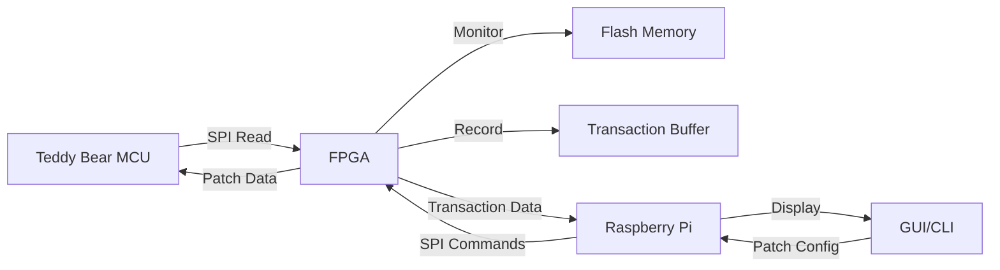

# Teddy Bear Reverse Engineering Project - Architecture Plan

## Project Background

This project aims to reverse-engineer a storytelling teddy bear by intercepting and analyzing the SPI communication between the bear's MCU (microcontroller) and its Flash memory. Since direct cryptographic analysis of the encrypted Flash memory contents proved unsuccessful, the approach involves using an FPGA to tap into the SPI bus and selectively modify (patch) data in real-time.

### Hardware Setup

```
┌─────────────┐         ┌──────────────┐         ┌─────────────┐
│   Teddy     │  SPI    │    FPGA      │  SPI    │ Flash       │
│   Bear MCU  │◄───────►│ Pass-Through │◄───────►│   Memory    │
└─────────────┘         │  (Monitor &  │         │ (Unsoldered │
       ╳                │   Modify)    │         │  & Rewired) │
       ╳ Original       └──────────────┘         └─────────────┘
       ╳ connection           ↕
       ╳ SEVERED         Separate SPI
       ╳                      ↓
                      ┌─────────────┐
                      │ Raspberry   │
                      │   Pi 3      │
                      └─────────────┘
```

**Important**: The Flash chip has been physically unsoldered from the teddy bear PCB and rewired through a breakout board. The original MCU→Flash connection is SEVERED.

The FPGA is now the complete intermediary between MCU and Flash memory:
- **MOSI (MCU→Flash)**: Pass-through with monitoring - records transaction addresses
- **MISO (Flash→MCU)**: Pass-through with optional modification - patches data in real-time
- **Flash memory is NEVER modified** - only the data stream is altered
- Records transaction details (address, byte count, timestamp) in internal buffer
- Communicates with Raspberry Pi via separate SPI interface for control and data retrieval

### Technical Details: SPI Protocol

#### FPGA-to-Pi SPI Communication

The FPGA acts as an SPI slave to the Raspberry Pi (master). Communication uses an Altera/Avalon IP core with special character escaping:

**Escape Sequence Handling:**
- `0x4a` is treated as an idle character by the Avalon IP core
- To transmit actual `0x4a`: send `0x4d 0x6a` (escape + XOR with 0x20)
- To transmit actual `0x4d`: send `0x4d 0x6d` (escape + XOR with 0x20)
- Escape character: `0x4d`
- XOR mask: `0x20`

**Command Protocol (First byte from Master):**

1. **0x00 - Clear Recorded Transactions**
   - Clears all transaction history in FPGA buffer
   - No additional data required

2. **0x01 - Read Next Transaction**
   - Returns 8 bytes from FPGA:
     - Bytes 0-2: 24-bit Flash address (big-endian, MSB first)
     - Bytes 3-5: 24-bit byte count (big-endian, MSB first)
     - Bytes 6-7: 16-bit timestamp in milliseconds (big-endian, MSB first)
   - Retrieves next transaction from FPGA's circular buffer
   - **Note**: All multi-byte values are transmitted big-endian

3. **0x02 - Setup Virtual Patch**
   - Requires 12 bytes from master:
     - Byte 0: Patch ID (0-15, allows up to 16 simultaneous patches)
     - Bytes 1-3: 24-bit patch address (big-endian)
     - Bytes 4-11: 8 bytes of replacement data
   - Patch triggers when MCU reads from the exact patch address
   - **Important:** Patch only triggers if transaction starts at patch address

4. **0x03 - Clear All Patches**
   - Removes all active patches
   - No additional data required

#### Patch Behavior

Patches are address-specific and only trigger when the MCU initiates a read transaction starting at the exact patch address. For example:
- Patch set at address `0x001000`
- MCU reads from `0x001000` → Patch applied ✓
- MCU reads from `0x001001` → Patch ignored ✗

This design allows precise control over which data modifications affect the MCU's behavior.

## Project Structure

```
rebear/
├── CMakeLists.txt                 # Root CMake configuration
├── README.md                      # Project documentation
├── plans/
│   └── project-architecture.md    # This file
├── docs/
│   ├── protocol.md               # Detailed SPI protocol documentation
│   └── usage.md                  # User guide
├── lib/
│   ├── CMakeLists.txt
│   ├── include/
│   │   └── rebear/
│   │       ├── spi_protocol.h    # Core protocol handling
│   │       ├── transaction.h     # Transaction data structures
│   │       ├── patch.h           # Patch management
│   │       └── escape_codec.h    # Avalon escape sequence codec
│   └── src/
│       ├── spi_protocol.cpp
│       ├── transaction.cpp
│       ├── patch.cpp
│       └── escape_codec.cpp
├── cli/
│   ├── CMakeLists.txt
│   ├── main.cpp                  # Command-line interface
│   └── commands/
│       ├── monitor.cpp           # Real-time monitoring
│       ├── patch.cpp             # Patch management
│       └── export.cpp            # Data export
└── gui/
    ├── CMakeLists.txt
    ├── main.cpp
    ├── mainwindow.h
    ├── mainwindow.cpp
    ├── mainwindow.ui
    ├── widgets/
    │   ├── transaction_viewer.h
    │   ├── transaction_viewer.cpp
    │   ├── patch_editor.h
    │   ├── patch_editor.cpp
    │   ├── address_visualizer.h
    │   └── address_visualizer.cpp
    └── resources/
        └── icons/
```

## Component Architecture

### 1. Core Library (`librebear`)

**Purpose:** Provide reusable C++ components for SPI communication and data management.

**Key Classes:**

#### `EscapeCodec`
- Encodes/decodes Avalon escape sequences
- Methods:
  - `std::vector<uint8_t> encode(const std::vector<uint8_t>& data)`
  - `std::vector<uint8_t> decode(const std::vector<uint8_t>& data)`
  - `bool needsEscape(uint8_t byte)`

#### `Transaction`
- Represents a single Flash read transaction
- Properties:
  - `uint32_t address` (24-bit, stored as 32-bit, big-endian from FPGA)
  - `uint32_t count` (24-bit byte count, big-endian from FPGA)
  - `uint16_t timestamp` (16-bit milliseconds, big-endian from FPGA)
  - `std::chrono::system_clock::time_point captureTime`
- Methods:
  - `static Transaction fromBytes(const uint8_t* data)` - parses 8-byte big-endian response
  - `std::string toString() const`

#### `Patch`
- Represents a virtual patch configuration
- Properties:
  - `uint8_t id` (0-15)
  - `uint32_t address` (24-bit)
  - `std::array<uint8_t, 8> data`
  - `bool enabled`
- Methods:
  - `std::vector<uint8_t> toBytes() const`
  - `static Patch fromBytes(const uint8_t* data)`

#### `SPIProtocol`
- Main interface for FPGA communication
- Methods:
  - `bool open(const std::string& device, uint32_t speed)`
  - `void close()`
  - `bool clearTransactions()`
  - `std::optional<Transaction> readTransaction()`
  - `bool setPatch(const Patch& patch)`
  - `bool clearPatches()`
  - `bool isConnected() const`
- Uses Linux `spidev` interface for Raspberry Pi

#### `PatchManager`
- High-level patch management
- Methods:
  - `bool addPatch(const Patch& patch)`
  - `bool removePatch(uint8_t id)`
  - `std::vector<Patch> getActivePatches() const`
  - `bool applyAll(SPIProtocol& spi)`
  - `bool saveToFile(const std::string& filename)`
  - `bool loadFromFile(const std::string& filename)`

### 2. Command-Line Utility (`rebear-cli`)

**Purpose:** Provide scriptable interface for automation and testing.

**Commands:**

```bash
# Monitor transactions in real-time
rebear-cli monitor [--device /dev/spidev0.0] [--duration 30s]

# Set a patch
rebear-cli patch set --id 0 --address 0x001000 --data "0102030405060708"

# List active patches
rebear-cli patch list

# Clear patches
rebear-cli patch clear [--id 0]

# Export transaction log
rebear-cli export --format csv --output transactions.csv

# Clear transaction buffer
rebear-cli clear
```

**Features:**
- JSON output option for scripting
- Configurable SPI device and speed
- Signal handling (CTRL+C graceful shutdown)
- Verbose/debug logging modes

### 3. Qt GUI Application (`rebear-gui`)

**Purpose:** User-friendly interface for interactive analysis.

**Main Window Layout:**

```
┌─────────────────────────────────────────────────────────────┐
│ File  Edit  View  Tools  Help                               │
├─────────────────────────────────────────────────────────────┤
│ [Connect] [Clear] [Export]    Device: /dev/spidev0.0  ▼     │
├──────────────────────────┬──────────────────────────────────┤
│                          │                                  │
│  Transaction Viewer      │   Address Visualizer             │
│  ┌────────────────────┐  │   ┌──────────────────────────┐   │
│  │ Time  | Addr | Cnt │  │   │                          │   │
│  │ 0.000 | 1000 | 256 │  │   │  [Visual heat map of     │   │
│  │ 0.015 | 1100 | 128 │  │   │   accessed addresses]    │   │
│  │ 0.032 | 2000 | 512 │  │   │                          │   │
│  │       ...           │  │   │                          │   │
│  └────────────────────┘  │   └──────────────────────────┘   │
│                          │                                  │
├──────────────────────────┴──────────────────────────────────┤
│  Patch Editor                                                │
│  ┌────────────────────────────────────────────────────────┐  │
│  │ ID | Address  | Data (hex)           | Status         │  │
│  │ 0  | 0x001000 | 01 02 03 04 05 06... | Active         │  │
│  │ 1  | 0x002000 | FF FF FF FF FF FF... | Active         │  │
│  └────────────────────────────────────────────────────────┘  │
│  [Add Patch] [Edit] [Remove] [Clear All] [Apply]            │
└─────────────────────────────────────────────────────────────┘
```

**Key Widgets:**

#### `TransactionViewer` (QTableView-based)
- Real-time display of captured transactions
- Sortable columns (time, address, count)
- Color coding for address ranges
- Export to CSV/JSON
- Search/filter functionality
- Auto-scroll option

#### `AddressVisualizer` (Custom QWidget)
- Visual heat map of Flash memory access patterns
- Configurable address range display
- Click to zoom into regions
- Highlight patched addresses
- Statistics overlay (most accessed regions)

#### `PatchEditor` (QTableView + custom delegates)
- Add/edit/remove patches
- Hex editor for patch data
- Address input with validation
- Enable/disable individual patches
- Import/export patch sets
- Visual feedback when patch triggers

**Additional Features:**
- Auto-reconnect on SPI errors
- Transaction recording to file
- Playback mode for recorded sessions
- Configurable update rate
- Status bar with connection info and statistics

## Data Flow



## Build System (CMake)

### Root CMakeLists.txt Structure

```cmake
cmake_minimum_required(VERSION 3.10)
project(rebear VERSION 1.0.0 LANGUAGES CXX)

set(CMAKE_CXX_STANDARD 17)
set(CMAKE_CXX_STANDARD_REQUIRED ON)

# Options
option(BUILD_CLI "Build command-line utility" ON)
option(BUILD_GUI "Build Qt GUI application" ON)
option(BUILD_TESTS "Build unit tests" OFF)

# Find dependencies
find_package(Threads REQUIRED)

if(BUILD_GUI)
    find_package(Qt5 COMPONENTS Core Widgets REQUIRED)
endif()

# Subdirectories
add_subdirectory(lib)
if(BUILD_CLI)
    add_subdirectory(cli)
endif()
if(BUILD_GUI)
    add_subdirectory(gui)
endif()
```

### Library Build Configuration

- Shared library by default
- Install headers to `include/rebear/`
- Generate pkg-config file
- Support for cross-compilation to Raspberry Pi

### Dependencies

**Core Library:**
- C++17 compiler (GCC 7+, Clang 5+)
- Linux kernel with SPI support (`spidev`)
- pthread

**CLI Utility:**
- Core library
- Optional: JSON library (nlohmann/json)

**GUI Application:**
- Core library
- Qt5 (Widgets, Core)
- Qt5 Charts (for address visualization)

## Testing Strategy

### Unit Tests (if BUILD_TESTS enabled)
- `EscapeCodec` encode/decode correctness
- `Transaction` serialization/deserialization
- `Patch` data validation
- Mock SPI device for protocol testing

### Integration Tests
- Loopback SPI test (if hardware available)
- Transaction buffer overflow handling
- Patch application verification

### Manual Testing Checklist
- [ ] Connect to FPGA successfully
- [ ] Capture transactions in real-time
- [ ] Apply patch and verify MCU behavior change
- [ ] Clear patches and verify normal operation
- [ ] Handle SPI disconnection gracefully
- [ ] Export/import patch configurations
- [ ] GUI responsiveness under high transaction rate

## Deployment

### Raspberry Pi Setup

```bash
# Enable SPI interface
sudo raspi-config
# Interface Options -> SPI -> Enable

# Install dependencies
sudo apt-get update
sudo apt-get install build-essential cmake qt5-default libqt5charts5-dev

# Build project
mkdir build && cd build
cmake ..
make -j4

# Install
sudo make install
```

### Cross-Compilation (Optional)

Use Raspberry Pi toolchain for building on development machine:
- Configure CMake with toolchain file
- Link against Pi's sysroot
- Deploy binaries via SSH/SCP

## Security Considerations

- SPI device access requires appropriate permissions (typically `spi` group)
- No network communication (local-only operation)
- Patch data validation to prevent buffer overflows
- Safe handling of FPGA communication errors

## Future Enhancements

1. **Pattern Recognition**
   - Automatic detection of repeated access patterns
   - Suggest likely code/data boundaries

2. **Differential Analysis**
   - Compare transaction logs before/after patches
   - Highlight behavioral changes

3. **Scripting Interface**
   - Python bindings for automated analysis
   - Lua scripting for custom patch logic

4. **Advanced Visualization**
   - 3D timeline view of memory access
   - Graph-based control flow inference

5. **Collaborative Features**
   - Share patch configurations
   - Community database of known patterns

## Documentation Requirements

1. **README.md** - Quick start guide
2. **docs/protocol.md** - Detailed SPI protocol specification
3. **docs/usage.md** - User guide with examples
4. **docs/api.md** - Library API reference
5. **docs/building.md** - Build instructions for various platforms
6. **CHANGELOG.md** - Version history

## Success Criteria

The project will be considered successful when:
- [ ] Core library successfully communicates with FPGA
- [ ] CLI utility can monitor transactions and apply patches
- [ ] GUI application provides intuitive real-time monitoring
- [ ] Patches reliably modify MCU behavior
- [ ] Documentation is complete and clear
- [ ] Code is well-tested and maintainable
- [ ] Project builds cleanly on Raspberry Pi 3
