# System Architecture Diagrams

## Hardware Architecture

### Physical Setup

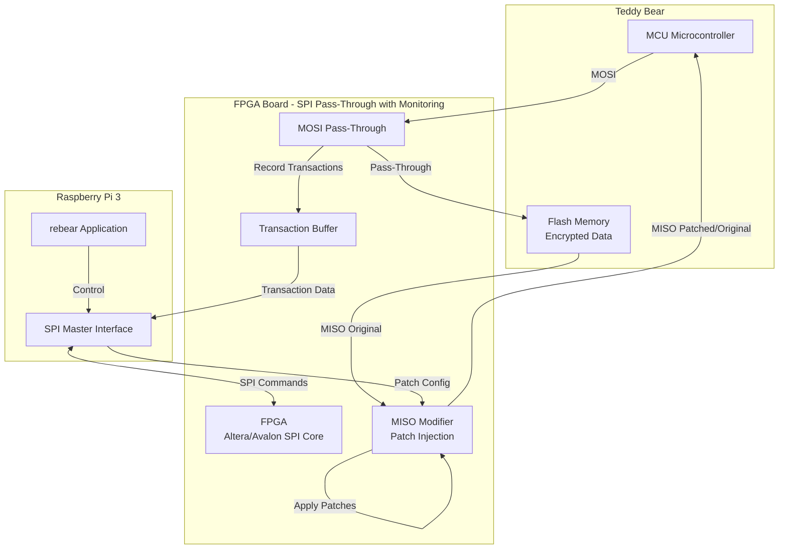

### SPI Bus Topology - Pass-Through Architecture

```
MCU ←→ FPGA ←→ Flash Memory
       (Man-in-the-Middle)

Detailed Signal Flow:

MCU MOSI ──────────► FPGA ──────────► Flash MOSI
                      │ (Monitor & Record)
                      │
MCU MISO ◄──────────┐ FPGA ◄────────── Flash MISO
                    │  │
                    │  └─ Patch Logic
                    │     (Modify MISO if patch matches)
                    │
                    └─ Original or Patched Data

MCU SCK ────────────► FPGA ────────────► Flash SCK
                      │ (Pass-Through)
                      
MCU CS ─────────────► FPGA ─────────────► Flash CS
                      │ (Pass-Through)


Separate SPI Bus for Pi ←→ FPGA Control:

Pi MOSI ◄──────────► FPGA SPI Slave
Pi MISO ◄──────────► FPGA SPI Slave
Pi SCK  ◄──────────► FPGA SPI Slave
Pi CS   ◄──────────► FPGA SPI Slave
```

**Key Points:**
- FPGA is spliced between MCU and Flash (man-in-the-middle)
- MOSI: Pass-through with monitoring (records addresses)
- MISO: Pass-through with optional modification (patches data)
- Flash memory is NEVER modified - only the data stream is altered
- Patches are applied in real-time by modifying MISO signal

## Software Architecture

### Component Hierarchy

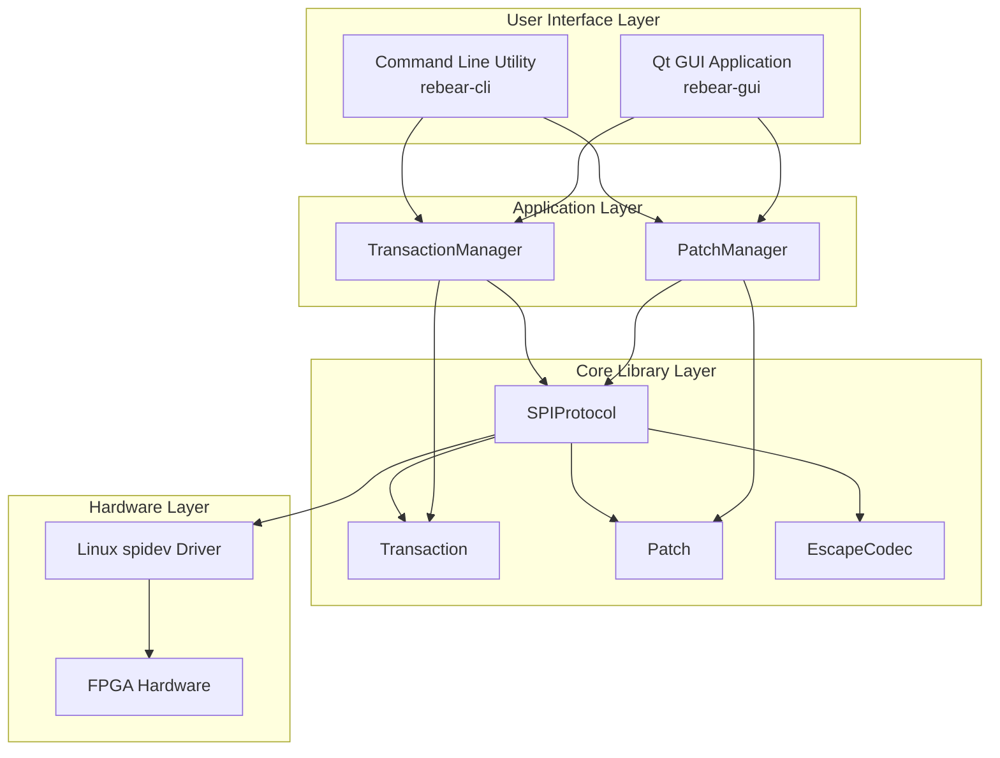

### Class Relationships

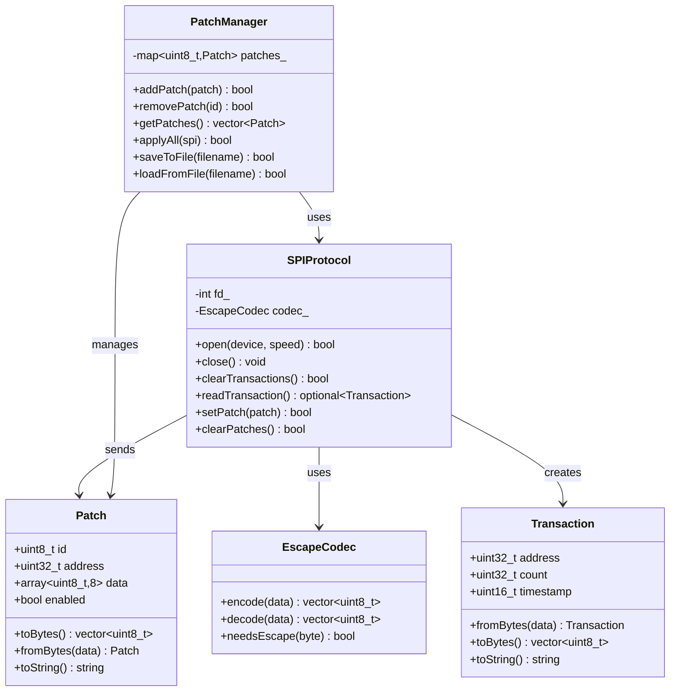

## Data Flow Diagrams

### Transaction Monitoring Flow

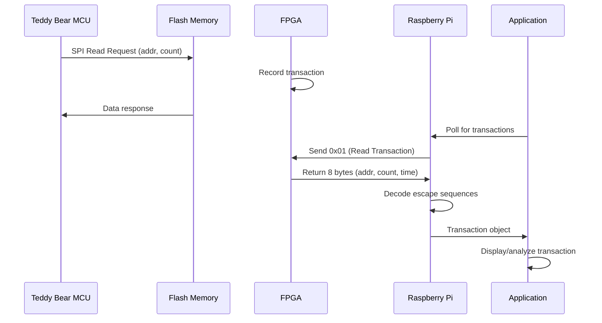

### Patch Application Flow

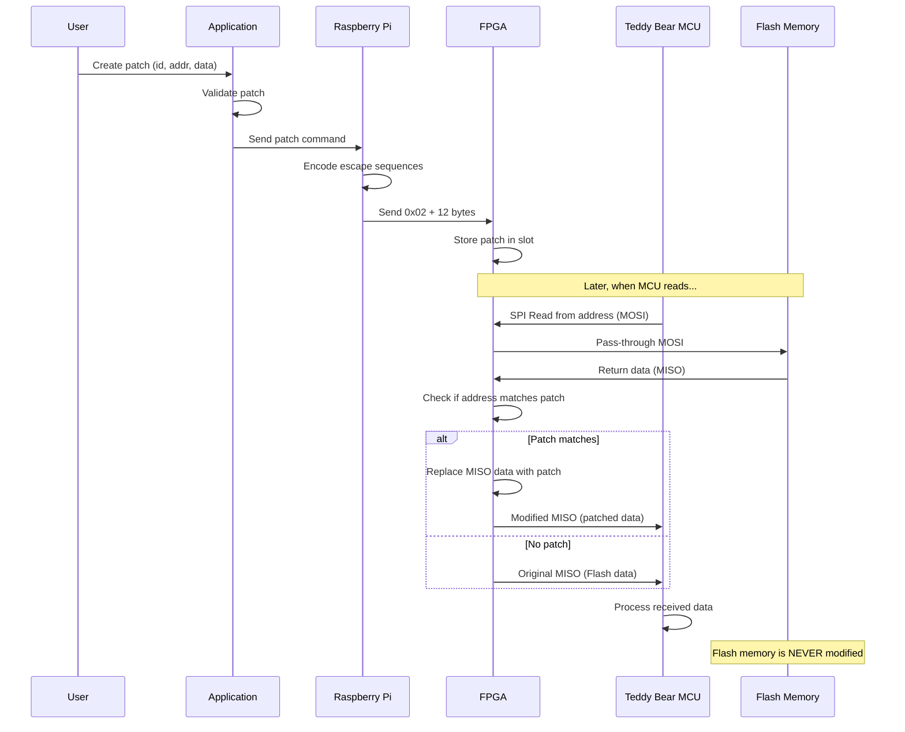

### Escape Encoding Flow

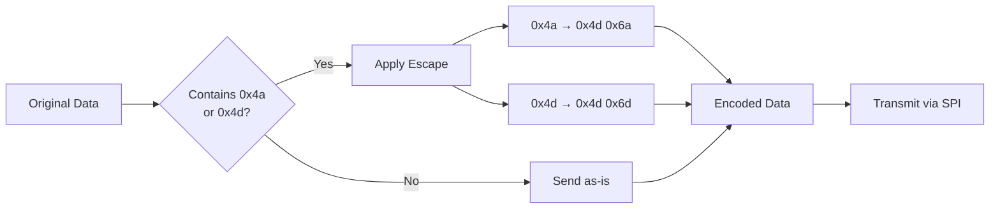

## GUI Layout Design

### Main Window Structure

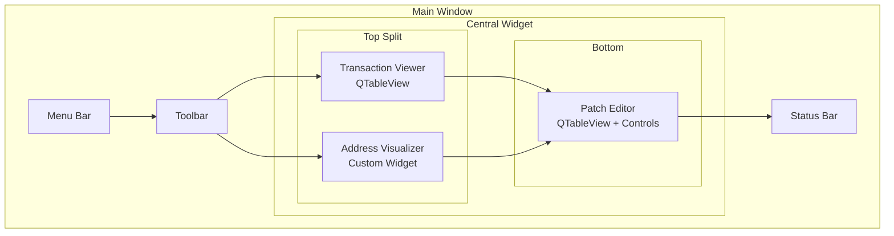

### Transaction Viewer Widget

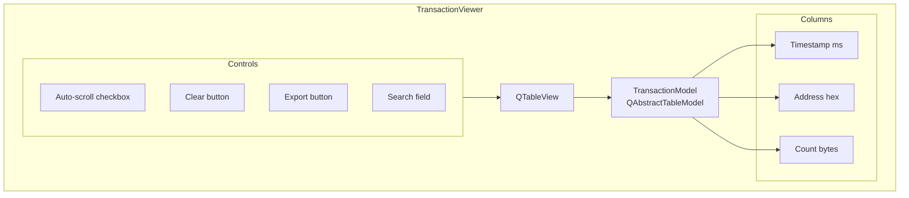

### Patch Editor Widget

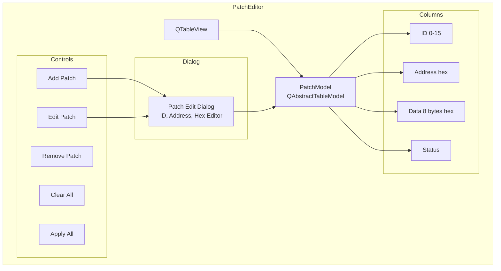

## State Diagrams

### Application Connection State

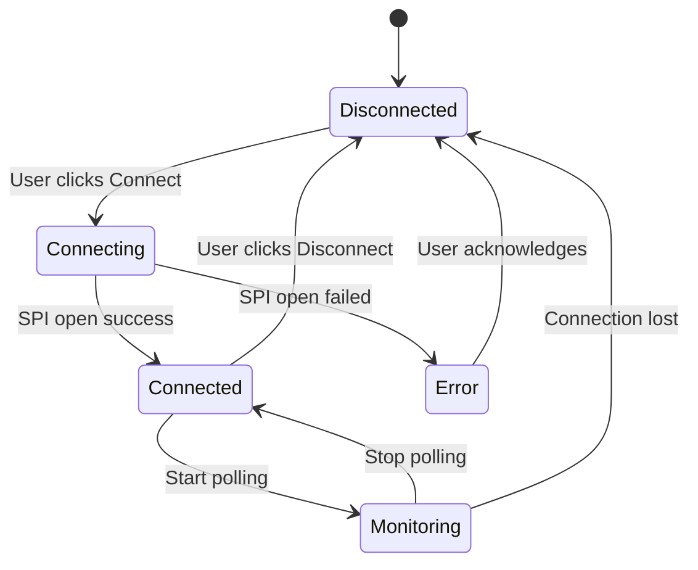

### Patch Lifecycle

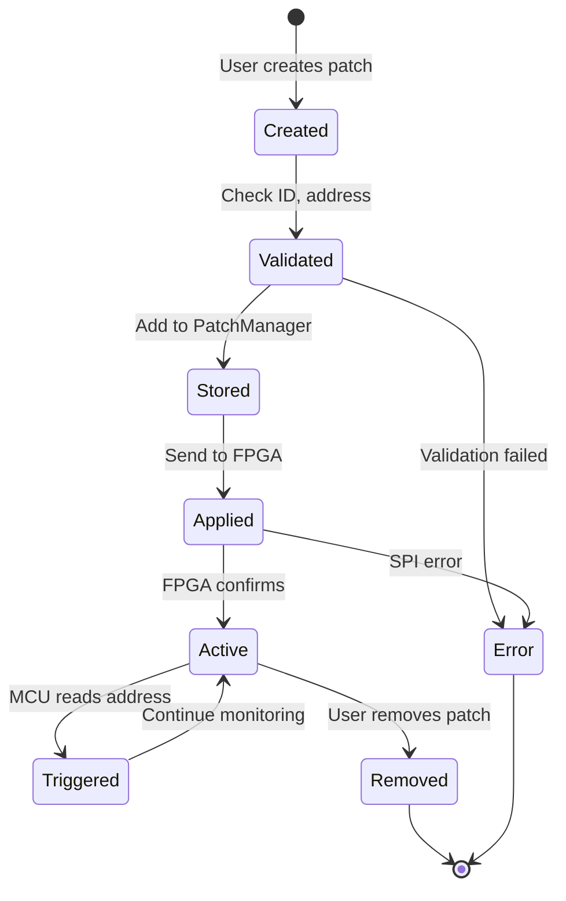

## Memory Layout

### Flash Memory Address Space

**Important**: The external Flash chip contains ONLY audio data and bookkeeping information. The MCU has its own internal program Flash that is not accessible via this SPI bus.

```
0x000000 ┌─────────────────────┐
         │                     │
         │   Header/Index?     │
         │   (Bookkeeping)     │
         │   (Encrypted)       │
         │                     │
0x001000 ├─────────────────────┤
         │                     │
         │   Audio Story 1     │
         │   (Encrypted)       │
         │                     │
0x010000 ├─────────────────────┤
         │                     │
         │   Audio Story 2     │
         │   (Encrypted)       │
         │                     │
0x020000 ├─────────────────────┤
         │                     │
         │   Audio Story 3     │
         │   (Encrypted)       │
         │                     │
         │        ...          │
         │                     │
0x100000 ├─────────────────────┤
         │                     │
         │   More Audio Data   │
         │   (Stories)         │
         │   (Encrypted)       │
         │                     │
0xFFFFFF └─────────────────────┘

Note: MCU program code is in separate internal Flash (not accessible)
```

### Transaction Buffer in FPGA

```
┌──────────────────────────────┐
│ Transaction 0 (8 bytes)      │
├──────────────────────────────┤
│ Transaction 1 (8 bytes)      │
├──────────────────────────────┤
│ Transaction 2 (8 bytes)      │
├──────────────────────────────┤
│          ...                 │
├──────────────────────────────┤
│ Transaction N-1 (8 bytes)    │
└──────────────────────────────┘
         ↑
    Read Pointer
    (advances on 0x01 command)
```

### Patch Storage in FPGA

```
Slot 0:  [ID=0] [Addr: 24-bit] [Data: 8 bytes] [Valid: 1-bit]
Slot 1:  [ID=1] [Addr: 24-bit] [Data: 8 bytes] [Valid: 1-bit]
Slot 2:  [ID=2] [Addr: 24-bit] [Data: 8 bytes] [Valid: 1-bit]
...
Slot 15: [ID=15] [Addr: 24-bit] [Data: 8 bytes] [Valid: 1-bit]
```

## Timing Diagrams

### SPI Transaction Timing

```
CS   ────┐                                    ┌────
         └────────────────────────────────────┘

SCK  ────┐ ┌─┐ ┌─┐ ┌─┐ ┌─┐ ┌─┐ ┌─┐ ┌─┐ ┌─┐ ┌─
         └─┘ └─┘ └─┘ └─┘ └─┘ └─┘ └─┘ └─┘ └─┘

MOSI ────< CMD >< D0 >< D1 >< D2 >< D3 >< ... >

MISO ────────────< R0 >< R1 >< R2 >< R3 >< ... >
         
         |<-Cmd->|<-------- Data Transfer ----->|
```

### Patch Trigger Timing

```
Time ──────────────────────────────────────────►

MCU Read:     ┌──────┐
              │ Addr │
              └──────┘
                 │
FPGA Match:      ├─ Compare with patches
                 │
                 ▼
Patch Found:   ┌────┐
               │Yes │
               └────┘
                 │
Data Inject:     ├─ Replace data
                 │
                 ▼
MCU Receive:   ┌──────────┐
               │Patch Data│
               └──────────┘
```

## Build System Flow

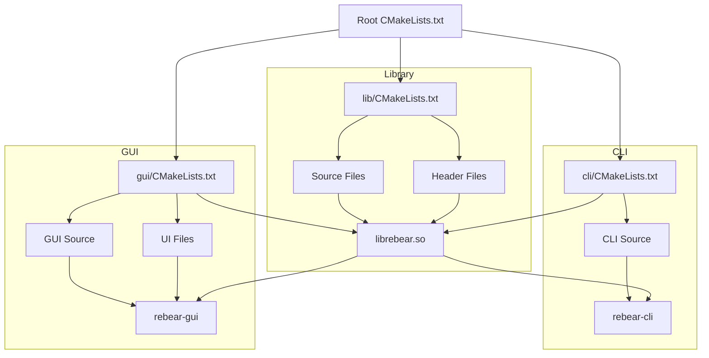

## Deployment Architecture

```mermaid
graph TB
    subgraph Development Machine
        DEV[Developer]
        SRC[Source Code]
        BUILD[Build System]
    end
    
    subgraph Raspberry Pi 3
        RPI[Raspberry Pi OS]
        DEPS[Dependencies<br/>Qt5, spidev]
        APP[rebear Application]
        SPI_DEV[/dev/spidev0.0]
    end
    
    subgraph FPGA
        FPGA_HW[FPGA Hardware]
        FPGA_FW[Firmware]
    end
    
    DEV --> SRC
    SRC --> BUILD
    BUILD -->|Cross-compile or<br/>Native build| APP
    APP --> RPI
    DEPS --> APP
    APP --> SPI_DEV
    SPI_DEV <-->|SPI Bus| FPGA_HW
    FPGA_FW --> FPGA_HW
```

## Error Handling Flow

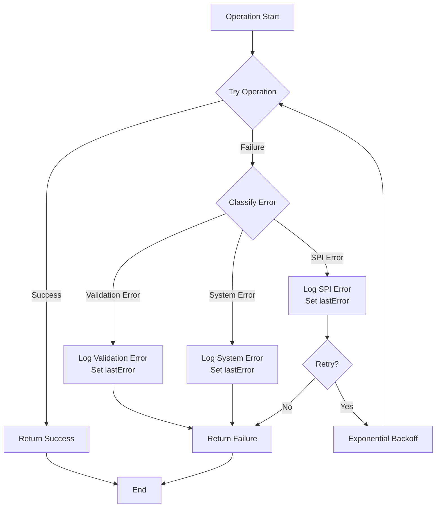

This comprehensive set of diagrams should help visualize the entire system architecture, data flows, and component interactions for the teddy bear reverse-engineering project.
